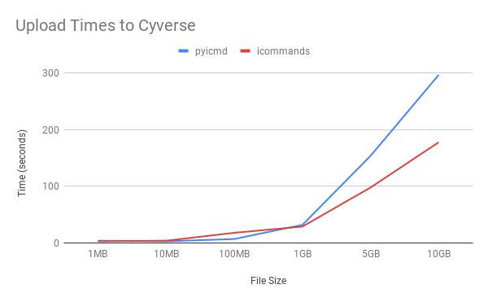

# Installation

```bash
pip install pyicmd
```

# Usage

```
usage: pyicmd [--host HOST] [--port PORT] [--user USER] [--passwd PASSWD]
              [--zone ZONE] [--version]
              [cmd]

    Python port of the iRODS icommands.

    Supports irods_environment.json file created by iinit. File can be at its
    default location ('~/.irods/irods_environment.json') or set via the
    IRODS_ENVIRONMENT_FILE variable.

    If user is set via the command line irods_environment.json is ignored
    and given (or default) command line arguments are used to open the session.


positional arguments:
  cmd               The icommand to run:
                       rm [file(s)]          Remove the files listed from the iRODS server
                       ls [path]             List the files and folders at the given path
                       put [loc] [file(s)]   Copy file(s) and folder(s) from the local computer to [loc] on the server
                       get [files(s)] [loc]  Copy file(s) and folder(s) from the server to [loc] on the local computer
                       test                  Test the connection to the iRODS server.
                       To learn more about a function, type pyicmd [cmd] -h


optional arguments:
  --host HOST      Address of iRODS server
  --port PORT      iRODS server port
  --user USER      iRODS username
  --passwd PASSWD  iRODS user password
  --zone ZONE      iRODS zone
  --version        show programs version number and exit
```

# Speed Test

By default, `icommands` uses multi-threading for uploads greater than ~35MB; `pyicmd` does not currently support multiple threaded uploads, causing it to be slower for large files.


# Development

To develop `pyicmd`, you will need:

- Unix shell
- Python 3
- `pytest`
- `pylint`

To publish the package, you'll also need:

- `wheel` (to publish)
- `twine` (to publish)

## Tests

Tests can be run with `make test`, or by running `pytest` from the project root.

Note that `test_functional.py` is dependency-free, while `test_cli.py` requires an IRODS server. You can easily start one with [this docker container](https://github.com/mjstealey/irods-provider-postgres):

```
docker run -d -p 1247:1247 mjstealey/irods-provider-postgres
```

`test_cli.py` expects the default IRODS username and password (`rods`/`rods`).

## Code Standard

Code should follow [Python's PEP8 style guide](https://www.python.org/dev/peps/pep-0008/). All contributions should pass standard pylint (`pip install pylint`) tests. These can be run using:

```bash
make lint
```
